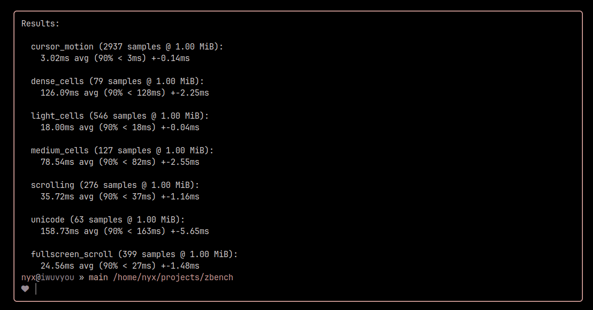

<div align="center">

# zbench



A terminal performance benchmarking tool written in Zig.

</div>

## Installation

### Releases

Prebuilt binaries can be found in the [releases](https://github.com/nnyyxxxx/zbench/releases) page

```bash
curl -fsSL https://github.com/nnyyxxxx/zbench/releases/latest/download/zbench -o zbench
chmod +x zbench
# Using `sudo` as an example, replace with your desired escalation tool.
sudo mv zbench /usr/bin
```

### Building

The built binary will be located inside of `zig-out/bin/`. Then it can be placed in `/usr/bin/`.

```bash
# Using `pacman` as an example, replace with your desired package manager.
sudo pacman -S --needed zig git base-devel
git clone https://github.com/nnyyxxxx/zbench.git
cd zbench
zig build --release=fast
```

## License

Copyright (C) 2024 [Nyx](https://github.com/nnyyxxxx)

This program is free software; you can redistribute it and/or modify it under the terms of the GNU General Public License version 2 as published by the Free Software Foundation.

This program is distributed in the hope that it will be useful, but WITHOUT ANY WARRANTY; without even the implied warranty of MERCHANTABILITY or FITNESS FOR A PARTICULAR PURPOSE. See the GNU General Public License for more details.

You should have received a copy of the GNU General Public License along with this program; if not, write to the Free Software Foundation, Inc., 51 Franklin Street, Fifth Floor, Boston, MA 02110-1301, USA or see <https://www.gnu.org/licenses/old-licenses/gpl-2.0.txt>

The full license can be found in the [license](license) file.